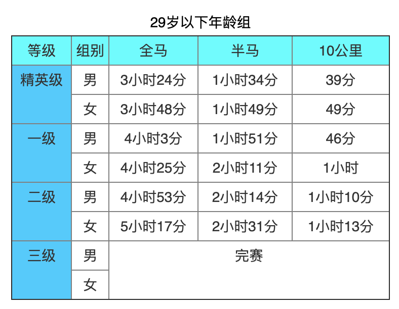

# 写给优秀程序员看的马拉松指南🏃

  
  
  
  

本Repo旨在分享跑步经历、经验。希望能启发到更多的程序员朋友开始一起跑步

⚠️ watch 本 repo 可及时获得文章更新通知～ 

点个 :star:  ，你的膝盖将像代码一样健壮～

## 关于我

  
  

我是一名某世界500 强公司程序员。跑步爱好者，跑龄四年，累计参加过10余场马拉松。全马 PB 是 3:30:15，半马是1:33:12，参照中国田协发布的[中国境内马拉松及相关运动大众选手等级评定实施办法](https://www.runchina.org.cn/portal.php?mod=download&id=83)，半马水平已经达到精英级，全马靠近精英级。

## 目录

- [跑步，其实挺简单的](./races/getting-start.md)
- 时间安排
- 著名网站、组织
  - [Runnersworld](https://www.runnersworld.com/)
- 社交
  - 跑团——独行疾，众行远
  - 社交软件
- 比赛经历
  - 我的马拉松元年
    - 首场比赛——绍兴马拉松156
  - [2019赛季](./races/2019-races-summary.md)
  - 2020赛季
    - 跑崩是什么滋味——无锡马拉松
    - 十度以下的大冷天PB——江北新区半程马拉松
    - 首次Pacer之旅——南京马拉松500
    - [MIRT出征广马——摸到了330的边儿](./races/2020-12-13-guangzhou-marathon-3_30_15.md)
  - 2021
    - [仙马——全新赛季，再获PB-133](./races/2021-04-11-xianlin-half-marathon-1_33_12.md) 
- 装备
  - 计时设备
  - 跑鞋
  - 内衣
- 伤痛
  - 髂胫束综合症
  - 磨损
- 路线规划
- [术语](./terms.md)
- 跑步文学
  - 《当我谈跑步我谈些什么》——村上春树
  - 《强风吹拂》——三浦紫苑

